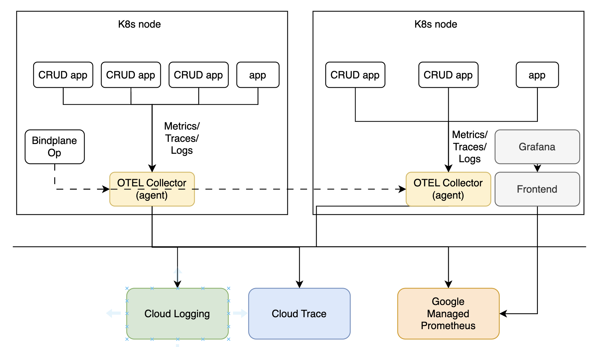

# TodoAPI
此應用程式展示如何使用 .NET core 6 WebAPI 與Dapper 建立 CRUD 應用程式 + CloudSQL on PostgreSQL。通過這個服務，我們也一併展示如何使用flyway，進行資料庫上版，以及OpenTelemtry對.NET Core的服務進行完整的監控。

## Order APIs
目前的實作提供四個 API Samples:
* Get All Orders:
```
curl http://34.80.234.108/order
```
* Get a selected Order (with order id as parameter)
```
curl http://34.80.234.108/order/Order006
```

* Post a new order
```
curl -X POST -H "Content-Type: application/json" -d '@payload.json'http://34.80.234.108/order

# payload.json
{
    "storeId": "Family Mart Taipei",
    "orderNumber": "Order006",
    "amount": "1773.00"
}
```
* Put (modify) an existing order (with order id)
```
curl -X PUT -H "Content-Type: application/json" -d '@payload.json' http://34.80.234.108/order/Order006
# payload.json
{
    "storeId": "Family Mart Taipei",
    "orderNumber": "Order006",
    "amount": "1773.00"
}
```
### Dapper
* 定義order物件 (Models/Orders/orderquery.cs)
* 在Service實現CRUD的ORM部分 (Services/order_service.cs)
* 實現Order Controller，連結API 與ORM的物件 (Controllers/orderController.cs)

## OpenTelemetry
[OpenTelemetry(OTEL)](https://opentelemetry.io/docs/languages/net/getting-started/)是個在近年很風行的監控架構，包含Metrics, Traces, and Logs，並通過區分Receiver, Processor, and Exporter三大區塊，來凝聚社群的開發方向。

OTEL的中文社群也非常龐大[Ref1](https://github.com/marcustung/obervability-opentelemetry/blob/main/OpenTelemetry%20%E5%8F%AF%E8%A7%80%E6%B8%AC%E6%80%A7%E7%9A%84%E6%9C%AA%E4%BE%86.pdf) & [Ref 2](https://github.com/open-telemetry/docs-cn/blob/main/OT.md)

這次我們選擇通過[ObserveIQ的Bindplane](https://github.com/observIQ/bindplane-op-helm)來部署OpenTelemetry Collector，而不是使用[OpenTelemetry Operator](https://github.com/open-telemetry/opentelemetry-operator)，來監控dotnet 6的服務，主要是因為Bindplane提供了一個UI介面，方便管理者可以監控部署的Collector群。以下是此次OpenTelemetry架構 

首先我們需要在dotnet中新增以下的package
```
dotnet add package OpenTelemetry.Extensions.Hosting
dotnet add package OpenTelemetry.Instrumentation.AspNetCore
dotnet add package OpenTelemetry.Exporter.Console
dotnet add package Npgsql.OpenTelemetry
dotnet add package OpenTelemetry.Instrumentation.Http
dotnet add package OpenTelemetry.Instrumentation.Runtime
```

dotnet core對於其原生元件提供了AutoInstrumentation (e.g. AspNetCore)，主要調整的部分是在program.cs。如果後端是使用SQL Server，可以直接使用pre-release的sqlclient instrumentation。
```
dotnet add package --prerelease OpenTelemetry.Instrumentation.SqlClient
```
此次由於我們是使用Npsql，我們需要使用對應的[PostgreSQL Instrumentation Tool](https://www.npgsql.org/doc/diagnostics/overview.html)，針對[Trace](https://www.npgsql.org/doc/diagnostics/tracing.html)與[Metrics](https://www.npgsql.org/doc/diagnostics/metrics.html)進行監控。
### Trace
這部分的實踐主要在Program.cs 以及OrderService.cs中。在Program.cs 中，加入AddSource("NPGSQL")以及AddNpgsql()，提供OrderService一個可以使用的TracerProviderBuilder。如果希望有更好的Trace，可以在OrderService.cs中提供對應的span資訊
### Metrics
這部分的實踐主要在Program.cs中，主要通過AddMeter("Npgsql")引入相關的監控數據，並通過OpenTelemetry發送到後端OpenTelemetry Collector中。